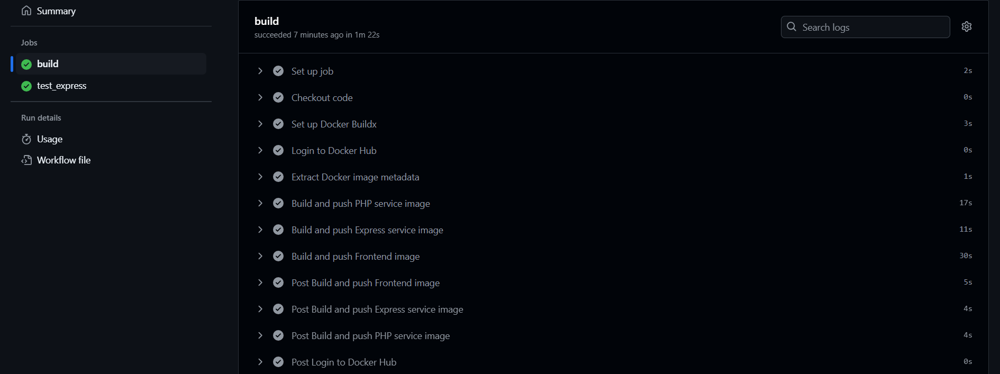
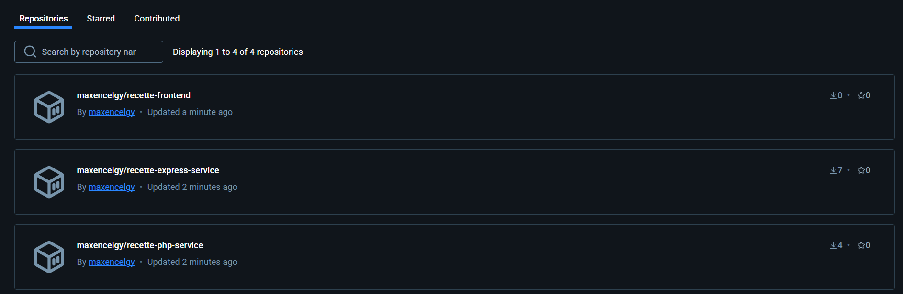

# Recette App Maxence

## Description
Recette App est une application complète permettant la gestion des recettes et des utilisateurs. Elle est composée de plusieurs services :
- Un backend en PHP pour gérer les recettes.
- Un backend en Express.js pour gérer les utilisateurs.
- Un frontend en React permettant l'interaction avec les services backend.

L'application est entièrement conteneurisée et déployée sur Docker Hub.

---

## Prérequis
- Docker installé sur votre machine.
- Un compte Docker Hub.
- Git pour cloner le projet.

---

## Installation et Utilisation

### 1. Cloner le projet
```bash
git clone https://github.com/votre-utilisateur/recette-app.git
cd recette-app
```

### 2. Configurer les variables d'environnement
Créer un fichier `.env` dans le service php-service renseigner les variables nécessaires (base de données, clés API, etc.).
````
DB_HOST=db
DB_NAME=recette_db
DB_USER=root
DB_PASS=example
````
### 3. Lancer l'application avec Docker Compose
```bash
docker-compose up -d
```
L'application sera disponible aux adresses suivantes :
- Frontend : `http://localhost:3000`
- API PHP : `http://localhost:8000`
- API Express : `http://localhost:5000`

### 4. Arrêter les services
```bash
docker-compose down
```

---

## Déploiement sur Docker Hub
L'application est automatiquement construite et poussée sur Docker Hub grâce à un pipeline CI/CD avec GitHub Actions.

### Images Docker disponibles
| Service   | Docker Hub |
|-----------|------------|
| PHP API   | `maxencelgy/recette-php-service:latest` |
| Express API | `maxencelgy/recette-express-service:latest` |
| Frontend  | `maxencelgy/recette-frontend:latest` |

### Preuve du déploiement
Ci-dessous, une capture d'écran prouvant que les images ont bien été poussées sur Docker Hub :



---
